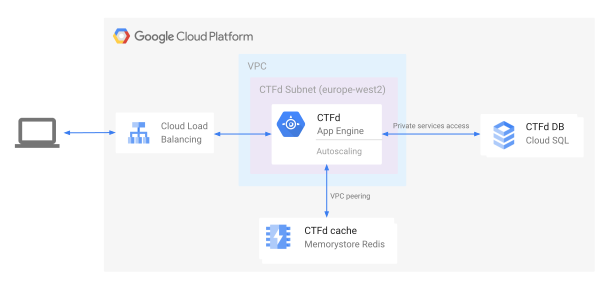

# ctfd-gcp

An IaaC deployment of [CTFd](https://ctfd.io/) in Google Cloud Platform, intended to be reliable and easily scalable for larger CTFs. Inspired by [DownUnderCTF/ctfd-appengine](https://github.com/DownUnderCTF/ctfd-appengine).

Used for pwned3 CTF. More details on the pwned3 infrastructure [here](https://www.atteniemi.com/ctf-infra-writeup/).

## Deployment Options

This repository provides two Terraform-based deployment options:

1. **App Engine Flex** (`terraform/`) - Original deployment using App Engine Flexible Environment
2. **Cloud Run** (`terraform-cloudrun/`) - Modern serverless deployment using Cloud Run v2 (recommended)

---

## Cloud Run Deployment (Recommended)

The Cloud Run deployment provides a modern, serverless infrastructure with automatic scaling, high availability, and simplified management.

### Architecture

- **Cloud Run v2**: Serverless container platform with autoscaling (1-10 instances)
- **Cloud SQL for PostgreSQL 15+**: Regional HA database with private IP via Private Service Connect
- **Memorystore Redis**: STANDARD_HA tier for high-availability caching
- **Cloud Storage**: GCS bucket with HMAC keys for S3-compatible uploads
- **Secret Manager**: Secure storage for SECRET_KEY, database password, and S3 HMAC keys
- **Global HTTPS Load Balancer**: Managed SSL certificate with serverless NEG to Cloud Run
- **VPC Networking**: Private networking with Serverless VPC Access connector

### Prerequisites

1. A GCP project with billing enabled
2. Domain name managed in Cloudflare (or another DNS provider)
3. Terraform >= 1.3 installed locally
4. `gcloud` CLI authenticated with your GCP account

### Deployment Steps

1. **Clone the repository**
   ```bash
   git clone https://github.com/bytecodesky/ctfd-gcp.git
   cd ctfd-gcp/terraform-cloudrun
   ```

2. **Configure your deployment**
   ```bash
   cp vars.auto.tfvars.example vars.auto.tfvars
   # Edit vars.auto.tfvars with your values:
   # - project_id: Your GCP project ID
   # - domain: Your CTFd domain (e.g., ctf.example.com)
   # - region: GCP region (default: us-central1)
   # - ctfd.image: CTFd Docker image version
   # - Adjust resource settings as needed
   ```

3. **Initialize and apply Terraform**
   ```bash
   terraform init
   terraform plan
   terraform apply
   ```

4. **Configure DNS in Cloudflare**
   
   After `terraform apply` completes, note the `load_balancer_ip` output.
   
   In Cloudflare:
   - Create an A record: `ctf` → `<load_balancer_ip>`
   - Enable Cloudflare proxy (orange cloud icon)
   - Set SSL/TLS mode to "Full (strict)"

5. **Wait for SSL certificate provisioning**
   
   The managed SSL certificate can take 15-60 minutes to provision. Check status:
   ```bash
   terraform output ssl_cert_status
   ```
   
   Once it shows "ACTIVE", your site will be accessible via HTTPS.

6. **Access CTFd and complete setup**
   
   Navigate to `https://ctf.example.com` and complete the CTFd initial setup:
   - Create admin account
   - Configure CTF settings
   - Upload challenges

### Post-Deployment

- **Monitoring**: Check Cloud Run logs in the GCP Console
- **Scaling**: Adjust `ctfd.min_instances` and `ctfd.max_instances` in `vars.auto.tfvars`
- **Updates**: Change `ctfd.image` to deploy new CTFd versions
- **Backups**: Cloud SQL automatic backups are enabled with point-in-time recovery

### Cleanup

To destroy all resources:
```bash
terraform destroy
```

**Note**: Some resources like Secret Manager secrets may have a retention period. Check GCP Console if you need to force-delete them.

---

## App Engine Flex Deployment (Legacy)

The original App Engine Flexible Environment deployment is still available in the `terraform/` directory.

### Architecture Overview

CTFd is deployed on App Engine Flex, which provides load balancing, auto-scaling, health checks and more right out of the box.

The application resides on a VPC which has a direct peering connection to a Memorystore Redis, allowing us connect CTFd to a cache that, again, requires very little manual maintenance.

There is also a private services access connection to Cloud SQL which is used as the database for CTFd. Again, scaling and other operation are easy.

CTFd stores uploaded challenge files in a Google Storage Bucket.

Furthermore, both the Memorystore and Cloud SQL are assigned only private IP addresses within our VPC, making inaccessible from the internet and enhancing security.



NOTE: this diagram is missing i.e. buckets used for challenge storage and buckets storing the CTFd Dockerfile
